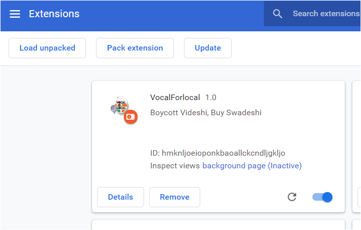
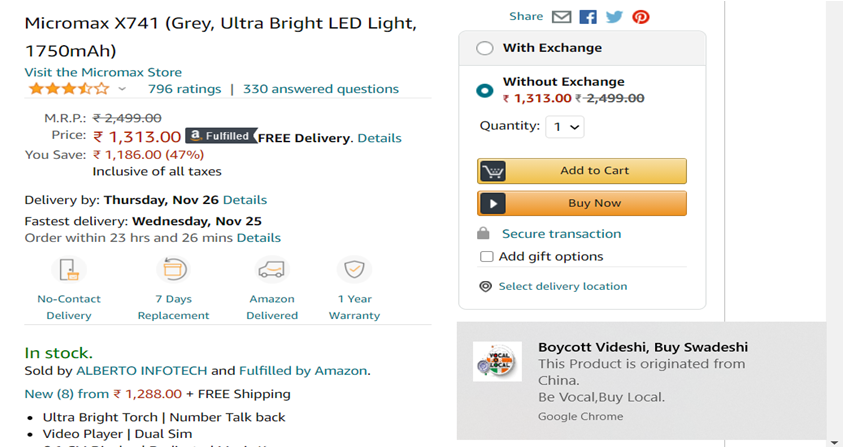

# VocalForLocal
VocalForLocal  is a chrome extension which is aiming to promote ‘Aatma Nirbhar Bharat’ and ‘Make in India’.This extension is a Page Action as it only operates on certain websites(shopping websites eg. amazon).

# Tech
JavaScript
Python-Flask

# Steps
1. Clone the Repo.
 
git clone https://github.com/Sushi22/VocalForLocal.git

2. Run pip -r requirements.txt
3. Install chromedriver of version compatible with your browser.
4. Go to Scraper folder in the project directory. 
5. Open origin_scraper.py file and add the absolute path of your chromedriver.
6. Now to run the Flask server, go to Scraper folder:
         
        cd Scraper
7. Now Run:
         
        py app.py

8. Open your browser and load the extension
    

    
    

9. This extension is a Page Action extension, and so it will be activated/highlighted on specific pages(for now it is amazon).
         For other sites, it will be grayed  out.
        

        
        

        

        
        

10. When user is on a specifc product page like shown below, and clicks on the extension icon origin of the product is shown in the form of a chrome notification(Make sure your chrome notifications are on).
        

            
        

# Link for installing Chromdriver
https://chromedriver.chromium.org/downloads

        

